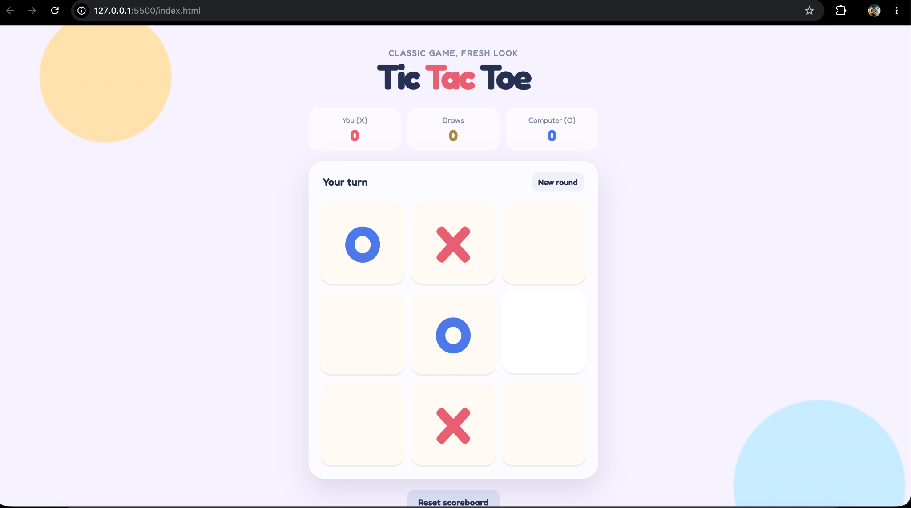
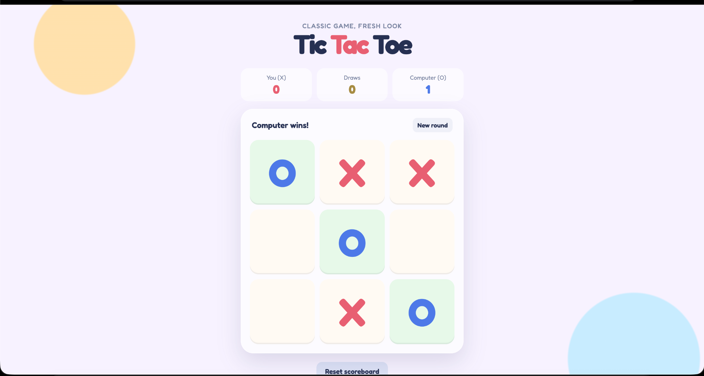

# Tic-Tac-Toe – AI-Powered Classic Game

# README.md

## 🎮 Overview

A modern implementation of the classic **Tic-Tac-Toe** game built using **HTML, CSS, and JavaScript**.

Challenge the computer in an interactive game featuring a clean user interface, score tracking, winner detection, round management, and responsive gameplay.

---

## ✨ Features

* 🤖 Play against the computer
* 🏆 Automatic winner detection
* 🤝 Draw detection
* 📊 Live scoreboard
* 🔄 Start a new round at any time
* 🎨 Modern and responsive UI
* 🟢 Winning combination highlighting
* 🔁 Scoreboard reset functionality

---

## 🛠️ Tech Stack

* HTML5
* CSS3
* JavaScript (ES6)

---

## 📂 Project Structure

```text
Tic-Tak-Toe/
│
├── index.html
├── style.css
├── script.js
└── README.md
```

---

## 📸 Screenshots

### Game Interface



### Computer Victory Screen



> Create an **assets** folder inside your repository and save your screenshots there.

```text
assets/
├── game-interface.png
└── computer-wins.png
```

---

## 🚀 Installation

### Clone the repository

```bash
git clone https://github.com/vedantdubey19/Tic-Tak-Toe.git
```

### Navigate to the project directory

```bash
cd Tic-Tak-Toe
```

### Run the application

Open **index.html** in your browser.

Or, if you're using VS Code:

```bash
Go Live → Open in Browser
```

---

## 🎯 How to Play

1. You play as **X**.
2. The computer plays as **O**.
3. Click an empty cell to make your move.
4. The computer automatically responds.
5. Complete three matching symbols in a row, column, or diagonal to win.
6. If all cells are filled without a winner, the game ends in a draw.

---

## 🎨 UI Highlights

* Soft pastel design
* Animated game board
* Highlighted winning cells
* Real-time score updates
* Minimal and distraction-free interface

---

## 🔮 Future Improvements

* Multiple difficulty levels
* Minimax AI implementation
* Dark mode
* Sound effects
* Player vs. Player mode
* Move history

---

## 👨‍💻 Author

**Vedant Dubey**

GitHub: https://github.com/vedantdubey19

LinkedIn: https://www.linkedin.com/in/vedant-dubey-a9697b278

---

## ⭐ Support

If you like this project, don't forget to **star the repository.**
